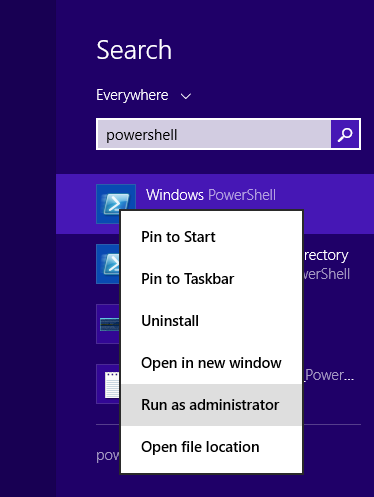
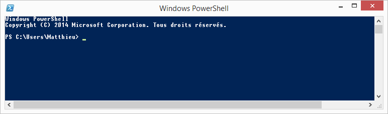
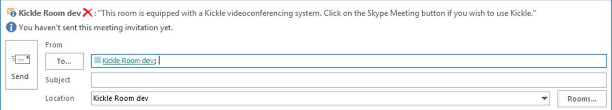

<!--
    Page : Administration/Hybrid
    Author : Alexis CONIA
    Latest Update : 14/04/2017
    Confidential : No
	Partner : No
	Public : Yes
    Version : 1.0
-->
### Creating Your User Account

!!! Info "Info"

    - This paragraph applies to Exchange Online and Skype for Business On Premise infrastructures only. If you are using another configuration, please refer to the section [Configuring Exchange On-Premises](Configuring Exchange On-Premise and Skype for Business On-Premise Accounts.md) or the section [Configuring Exchange Online and Skype for Business Online (Office 365) accounts](Configuring Exchange Online and Skype for Business Online (Office 365) Accounts.md).
    - You must have sufficient rights to access your Office 365 account using Exchange Remote PowerShell.

If you are using the directory synchronization feature, create your account on your local Active Directory and synchronize it with the cloud.
Sync Operation can be automatic (according to your configuration). You can force it by using the appropriate tools.
Once successfully synchronized with the cloud, enable the Exchange modality on this account.

### Creating and Configuring a Room Mailbox Account for Exchange Online (Office 365)

#### Starting PowerShell

The following commands are PowerShell commands. To launch PowerShell, simply search for PowerShell in the Search field in Windows 7 or Windows 8.Start PowerShell with the option “Run as an administrator”.





For more information, please refer to the following TechNet article: <https://technet.microsoft.com/fr-fr/library/bb978526.aspx>.

#### Logging on to Exchange Online

To use an existing Room Mailbox account (KICKLE01 in the example below), run the PowerShell cmdlet below to log in to Exchange Online:

``` powershell
$UserCredential = Get-Credential
```

Enter an Exchange Online username / password with administrator privileges.Then, run the cmdlet below to connect to your Exchange Online.

``` powershell
$Session = New-PSSession -ConfigurationName Microsoft.Exchange -ConnectionUri https://outlook.office365.com/powershell-liveid/ -Credential $UserCredential -Authentication Basic -AllowRedirection
```

Run the cmdlet below to import your session so you can run Exchange commands in your Exchange Online.

``` powershell
Import-PSSession $Session
```

#### Using an existing Room Mailbox Account in Exchange Online (Office 365)

If you are already using a Room Mailbox account for the KICKLE room, you can follow the steps below. However, we recommend that you delete and then recreate the account. To use an existing Exchange account (KICKLE01 in this example), execute the following cmdlet:

``` powershell
$rm="KICKLE01@mycompany.com"
```

``` powershell
$newpass='pass@word1'
```

``` powershell
Set-Mailbox -MicrosoftOnlineServicesID $rm -room -Name "KICKLE Room" -RoomMailboxPassword (ConvertTo-SecureString $newpass -AsPlainText -Force) -EnableRoomMailboxAccount $true
```

#### Configuring the Exchange Room Mailbox Account

The cmdlet below will configure the Exchange Online account to accept or refuse meeting notifications automatically based on whether the room is available.

``` powershell
Set-CalendarProcessing -Identity $rm -AutomateProcessing AutoAccept -AddOrganizerToSubject $false –DeleteSubject $false -RemovePrivateProperty $false
```

#### Configuring MailTip

The MailTip reminds the organizer that the room is equipped with a KICKLE videoconferencing system. The user must click on the “Skype for Business Meeting” button if he or she wishes to use KICKLE.



!!! Tip "Configuring mailtip :"
    Set-Mailbox -Identity $rm -MailTip "This room is equipped with a KICKLE videoconferencing system. Click on the Skype for Business Meeting button if you wish to use KICKLE."

You can also use the following cmdlets to adapt the message according to the exact location of the room.

``` powershell
$Temp = Get-Mailbox $rm
```

``` powershell
$Temp.MailTipTranslations += "ES: Esta sala de reuniones tiene una solución KICKLE"
```

``` powershell
Set-Mailbox -Identity $rm -MailTipTranslations $Temp.MailTipTranslations
```

#### Configuring the Message Received When a Kickle Room is Booked

You can configure the message that the meeting organizer will receive when booking the room by running the following cmdlet:

!!! Tip "Configuring the message received when a KICKLE room is booked : "
    Set-CalendarProcessing -Identity $rm –AddAdditionalResponse $TRUE –AdditionalResponse “If the meeting has been refused, it is because the meeting room is not available at the time specified.```<br><br>```If the meeting is accepted, congratulations! You have planned your KICKLE meeting successfully.```<br><br>```Do not forget that KICKLE should not wait in the waiting room. To check, open the KICKLE meeting and then click on Meeting Options. Check that no guest is waiting in the waiting room. Also check that KICKLE is the organizer.”

#### Allowing a Person Outside the Company to Schedule a Meeting

If you wish to enable the use of KICKLE in "Planned Meeting" mode by somebody who does not belong to the company, run the command below:

``` powershell
Set-CalendarProcessing $rm –ProcessExternalMeetingMessages $true
```

Companies who want to use your KICKLE must add your domain as a RemoteDomain. The following commands must be executed on your external collaborator's Office 365 infrastructure.

``` powershell
New-RemoteDomain –DomainName mycompany.com –Name mycompany.com
```

``` powershell
Set-RemoteDomain mycompany.com –TNEFEnabled $true
```

#### Synchronization

Once the Exchange modality has been added to the user, wait or force the synchronization between your local active directory and the cloud.You can check the synchronization by looking at the email properties in the DSA Console.

#### Configuring Skype for Business On-Premises Accounts

Once you have configured the Room Mailbox account, use Skype for Business Server Management Shell to enable the Skype for Business account to use the cmdlet below.

``` powershell
    Enable-CsMeetingRoom -SipAddress "sip:KICKLE01@mycompany.com" -domaincontroller DC-ND-001.company.com -RegistrarPool SKYPE FOR BUSINESSPool15.company.com -Identity LRS01
```

!!! note
    Skype for Business Server Management Shell is automatically installed on each Standard Edition Server or frontend Enterprise Edition Skype for Business Server. For more information, please refer to: ***<https://technet.microsoft.com/fr-fr/library/gg398474.aspx>.***


