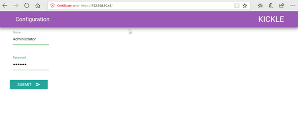

<!--
    Page : Administration/Kickle Configuration
    Author : Alexis CONIA
    Latest Update : 14/04/2017
    Confidential : No
	Partner : No
	Public : Yes
    Version : 1.0
-->

### Connecting Kickle

Each Kickle unit embeds its own website and GUI settings. First, ensure that Kickle is on a dhcp network. Then, make sure that your computer is on the same sub-network.

- Connect Kickle to the screen's HDMI port.
- If the screen is a touchscreen, connect the touchscreen source to Kickle via USB. If not, connect a USB mouse.
- Connect the camera and the microphone to USB ports **on the back of the Kickle**.
- Start Kickle by pressing the power button.

#### Setting Up Kickle Using First Time Configuration

Before starting the configuration, make sure Kickle requirements are met.

To start configuration, press the configuration icon.

First, you'll need to choose your preferred language setting, keyboard language layout and Kickle's time zone.

!!! Info "Info"

    - Kickle provides 3 different languages (English, French and German).

    - The next button will become bold once you have selected all the information.

Second step: select the network configuration and choose a **dynamic** or **static** connection.

!!! Note "Note"
    If you set it as a static connection, be sure that the ip address allows Kickle unit to connect to the internet.

Here, if your internet connection requires a proxy, you can enable this feature.

!!! Info "Info"
    We strongly recommend that you bypass your proxy with a specific rule. Proxy configuration is very complex within a Skype for Business infrastructure.

Here, you must fill out Skype authentication. Skype's default setting is Office 365, but if you need to configure it with an On-Premises account, be sure to uncheck **SKYPE is Office 365**.

!!! Info "Info"
    Press the **Test** icon to process test connections. If the test fails, we advise you to check the authentication account whether it has been activated or not and we also recommend checking the network connection.
    Once you have an **OK connection**, press the next button to continue.

!!! Info "Info"
    - Office 365 EWS URL address:
      Type or Copy--> https://outlook.office365.com/EWS/Exchange.asmx <--end of copy.

    - How to find EWS URL address on on-premises server:
      Open the Exchange Management Shell on the Exchange server
      Type or copy--> ***Get-WebServicesVirtualDirectory |Select name, *url* | fl*** <--end of copy.

Here, you can select the display scaling that your Kickle screen use and turn screen off features.

!!! Info "Info"

    - Kickle is compatible with any kind of screen whether it is a touchscreen panel or non-touchscreen panel. The best configuration is full-HD or 4K touchscreen

    - The default value of turn screen off features is 0.

Here, you can add a local NTP server and enable ICMP requests for your Kickle unit.

Here, you can customize email invitation template.

**Congratulations!**

To complete the configuration, press the reboot icon to apply the changes.

#### Setting Up Kickle

Kickle's embedded website loads automatically.

Ask the Kickle support team for the admin account and password. <http://support.Kickle.com>.

You can change the password at any time (see chapter 10).

You can also browse your Kickle unit website (https://ip-address-of-Kickle) from remote computer on the same sub-network.

Reconnect using the administrator account. Then, complete the fields in the Web GUI:

- The **username** is the SIP address.
- The **login** is the associated AD account  (if you use Skype for Business Online / Office 365, the username and login are the same).
- The Exchange login is the associated AD account (if you use Skype for Business Online / Office 365, leave these fields blank).
- The **Exchange login** is the associated AD account (if you use Skype for Business Online / Office 365, leave these fields blank).

Specify the type of network connection:

dynamic or static IP.

!!! warning " "
    If you choose fixed IP, you must ensure that Kickle remains accessible. Changing the IP address takes effect immediately.

Type the **Exchange webservice** URL.

 

Configure proxy settings, if applicable.

!!! note "Note"
    We strongly recommend that you to bypass your proxy with a specific rule. Proxy configuration is very complex within a Skype for Business infrastructure.

Type the **NTP servers** if needed.

You can change the size of the text, apps, and other items, and even change the Kickle background image.

You will need to **Reboot** the Kickle to apply the new configuration settings.

