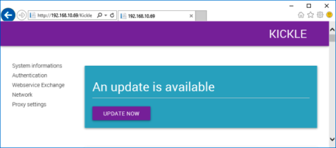

<!--
    Page : Administration/Update
    Author : Alexis CONIA
    Latest Update : 27/03/2016
    Confidential : No
	Partner : No
	Public : Yes
    Version : 1.0
-->
### Updating Kickle

#### Updating From a Remote Computer

From the remote computer on the same sub-network or through the Kickle embedded browser, browse your Kickle unit website (http://ip-address-of-kickle).

!!! Tip "Tip"
    Select **Information** from the **Help Menu** by pressing the **CTRL + TAB** keys on the keyboard (virtual or real) to check Kickle's ip address.

Reconnect using the administrator account.

Ask Kickle to get the admin account and the password <http://support.kickle.com>.

#### Updating From The Kickle Unit

- From the Kickle unit, click on browser icon ![Browser] (/img/icon-browser.png).
- Type https://localhost/ in the browser.
- Authentication using a Kickle user.
- If an update is available, the **update now** button will appear.
- Click on **update now**.
- Update will download and install automatically.

!!! Warning " "
    A reboot may be required.

