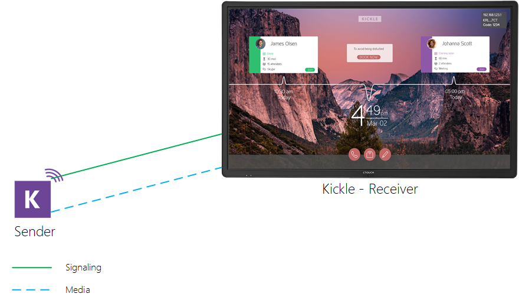

<!--
    Page : Beta/Boila
    Author : Alexis CONIA
    Latest Update : 19/03/2018
    Confidential : No
	Partner : No
	Public : Yes
    Version : 1.0
-->

#Voila

Voila is a project that we have been working on for a few months now. 
Our goal is to create a great experience with kickle, locally in the meeting room.

We are very excited to be releasing it as part of our beta release!

##Features
We will launch certain features gradually. Today's version will be limited to: 

* Local Sharing
* Windows 10 Sender

##Architecture
The sender is connected directly to the receiver via Kickle. At this time, Kickle should be reachable by the sender on the local network.

##Network Requirements

###Ports

|From   |To   | Protocol and Port   |Comments   |
|---|---|---|---|
| Sender (PC)   | Kickle  | TCP (443)  | Commands   |
| Sender (PC)   | Kickle  | UDP (1024-65535)* | Media |

*Of Course, we are working hard to limit this ports range. It will also be configurable by IT Administrators

