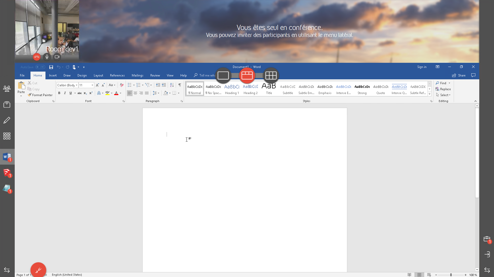
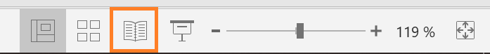
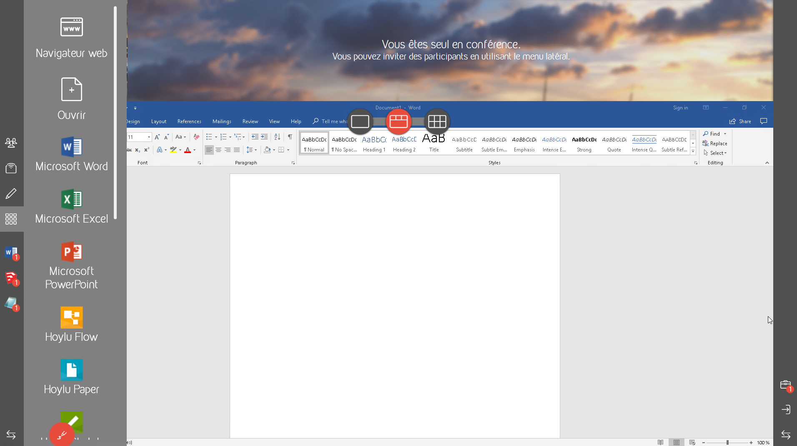
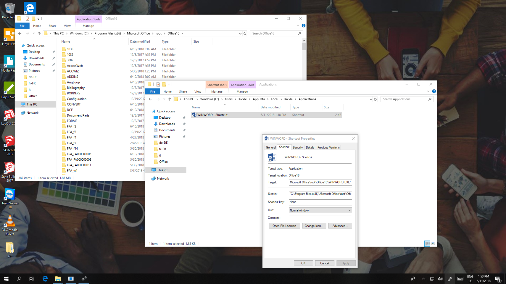
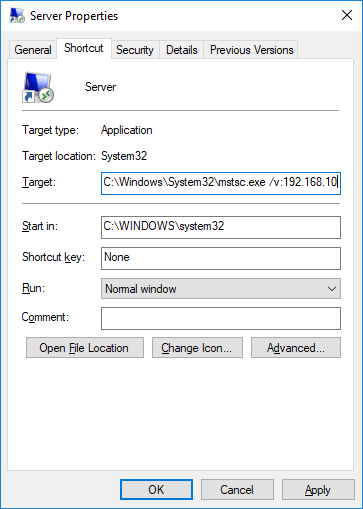

<!--
    Page : Features/Applications
    Author : Jérémie Gilliot
    Latest Update : 11/06/2018
    Confidential : No
	Partner : No
	Public : Yes
    Version : 1.0
-->

# Additional Applications

Kickle is able to include your applications in the collaborative ecosystem. After installation and set-up, you'll have the ability to open additionnal documents, switch between Kickle applications and custom applications, and export documents at the end of your work session.

## Installation
To install additional applications, open a Powershell command from the Kickle session to stay in the `Kickle` user's context. Here, you will have permissions to run installer and configure the system.

Press `Ctrl + F2` to open an administrator command and type `explorer` to open a Windows file explorer. Browse USB drive or network to reach your application installer. Follow standard instructions to install your applications. Once the installation is finished, we recommend running new applications a first time to ensure that all components and licences are registered and to complete the first-run configurations: such as file types associations or the saving format for Office.

### File types associations
During the installation of applications, the corresponding extension files are associated with the new application. You can also customize associations with the regular Windows `OpenWith` interface, don't forget to tick the checkbox `Always use this app to open .XXX files` to save your changes.

### Particular cases
We have listed below some instructions to improve the experience with certain softwares that we have tested:

* __Office preferences__: for an easy open and save file experience, we recommend deactivating the "backstage mode" in the save options.
<!-- TODO force kickle explorer handling in all cases -->

* __Powerpoint__: instead of using the fullscreen slideshow view, we encourage users to try the "reading view". In this mode, the Powerpoint presentation will take place through Kickle as a regular application, allowing for annotation and a view of remote collaborators. 

* __Polycom RealDesktop Presence__: by default when the application is closed, it is actually minimized in the system tray. In order for Kickle to behave well, this feature needs to be deactivated following installation of the application. Then, edit the following registry key: `HKCU\SOFTWARE\Polycom\RealPresence Desktop` and set the value `ExitOnClick` to `TRUE`.
<!-- `HKLM\SOFTWARE\Wow6432Node\Polycom\RealPresence\Desktop` S-1-5-21-XXXX-500 -->

## Shortcuts
Kickle's files explorer automatically detects file types associations, files appear in the file hierarchy only if an application is associated to the corresponding type.

Furthermore, it could be useful to add a shortcut to launch an application. To create a shortcut, you must create a folder named `Applications` at the path `C:\Users\Kickle\AppData\Local\Kickle\` and put the desired executable shortcuts inside it. For example you can drag-and-drop the `WinWord.exe` executable while holding the `Alt` modifier key to easily create a shortcut for the Word application. Following that, you can customize the properties such as the displayed name or the icon. You can also specified a document as the target of the link, but never include a document directly.

### Add arguments

Some specific usage cases may require you to pass arguments to the executable. The usage described here allows one to create a shortcut for RDP hosts, create a shortcut for `c:\Windows\System32\mstcs.exe` and add the IP address exactly as it appears in a command line `/v:192.168.10.1`. You can use the name of the shortcut to distinguish several hosts as "Documents server" or "Room 23 computer".

If the executable path or arguments contain spaces, you must enclose them in quotes like this `"[PATH TO EXE]" "[ARGUMENTS]"` (example: `"C:\Users\Kickle\AppData\Local\Polycom\RealPresence Desktop\RealPresenceDesktop.exe"`).

