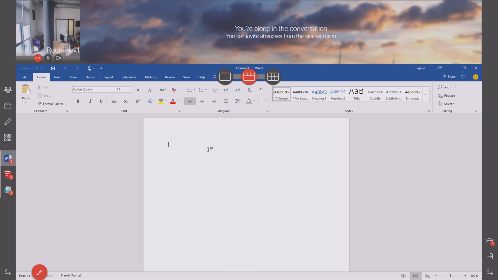
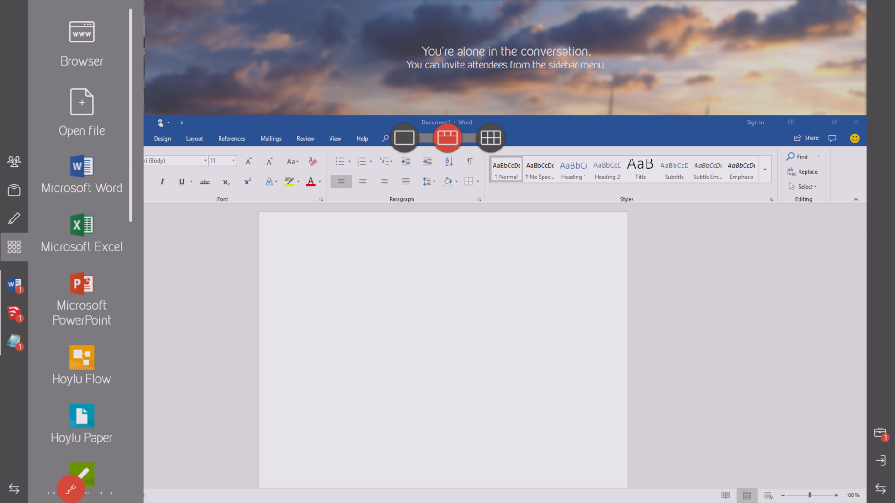

<!--
    Page : Features/Applications
    Author : Jérémie Gilliot
    Latest Update : 11/06/2018
    Confidential : No
	Partner : No
	Public : Yes
    Version : 1.0
-->

# Additional Applications

Kickle is able to include your applications into the collaborative ecosystem. After installation and set-up, it becomes possible to open additionnal documents, switch between Kickle applications and custom applications, and finally export documents at the end of your working session.

## Installation
To install additional applications, start to switch into [admin mode](http://docs.kickle.com/manage/admin-mode/). In this mode, you will have permissions to run installer and configure the system.

Follow standard instructions to install your applications, just be sure to install it for all users. Once the installation is finished, we recommand to run new-applications a first time to ensure that all components and licences are registered and to complete some first-run configurations − such as file types associations or saving format for Office.

### Particular cases
We list below some instructions to improve the experience with softwares that we tested:
* __Office preferences__: to easying open and save file experience, we recommand to desactivate the "backstage mode" in saving options.
<!-- TODO force kickle explorer handling in all cases -->

* __Powerpoint__: Instead of use the fullscreen slideshow view, we encourage your users to try the "reading view". In this mode the Powerpoint presentation will took place into the Kickle as a regular application, allowing annotation and visualization of remote collaborators. 

* __Polycom RealDesktop Presence__: by default when the application is closed, it is actually reduce in the system tray. In order to have a good behaviour in Kickle, this feature needs to be desactivate after installation of the application. Edit the following registry key: `HKCU\SOFTWARE\Polycom\RealPresence Desktop` and set the value `ExitOnClick` to `TRUE`.
<!-- `HKLM\SOFTWARE\Wow6432Node\Polycom\RealPresence\Desktop` S-1-5-21-XXXX-500 -->

## Shortcuts
During installation of applications, the corresponding extension files are associated with the new application. Kickle's files explorer will automatically detect association in-betwenn and the associated files will appears in file hierarchy.

Furthermore, it could be useful to add shortcut to launch application. To create a shortcut, you have to create a folder named `Applications` at the path `C:\Users\Kickle\AppData\Local\Kickle\` and place inside the shortcuts to desired executables. For example you can drag-and-drop the `WinWord.exe` executable while holding the `Alt` modifier key to easily create a shortcut to the Word application. After that, you can customize the properties such as the displayed name or the icon. You can specified also a document as the target of the link, but never include a document directly.

### Add arguments

Some specific usage may require to pass arguments to the executable. The usage described here allows to create shortcut to RDP hosts, create a shortcut to `c:\Windows\System32\mstcs.exe` and add the IP address exactly as in a command line `/v:192.168.10.1`. You can use the name of shortcut to distinguish several hosts as "Documents server" or "Room 23 computer".

If the executable path or arguments contains spaces, you have to enclosed them in quotes like that `"[PATH TO EXE]" "[ARGUMENTS]"` (example `"C:\Users\Kickle\AppData\Local\Polycom\RealPresence Desktop\RealPresenceDesktop.exe"`).

