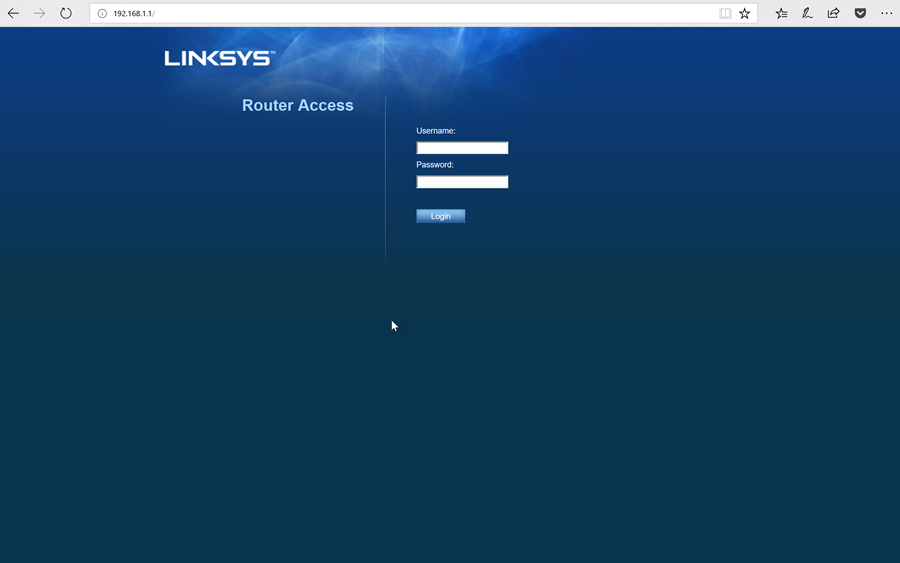
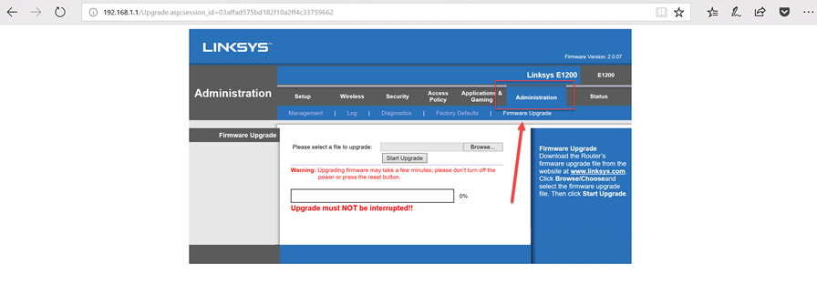
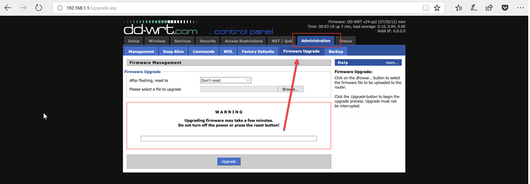
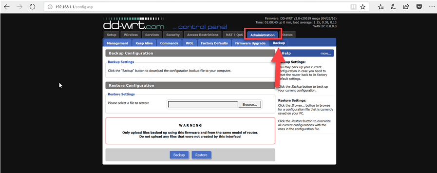
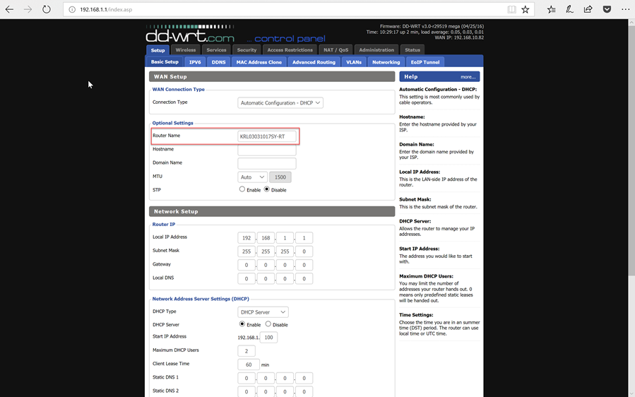
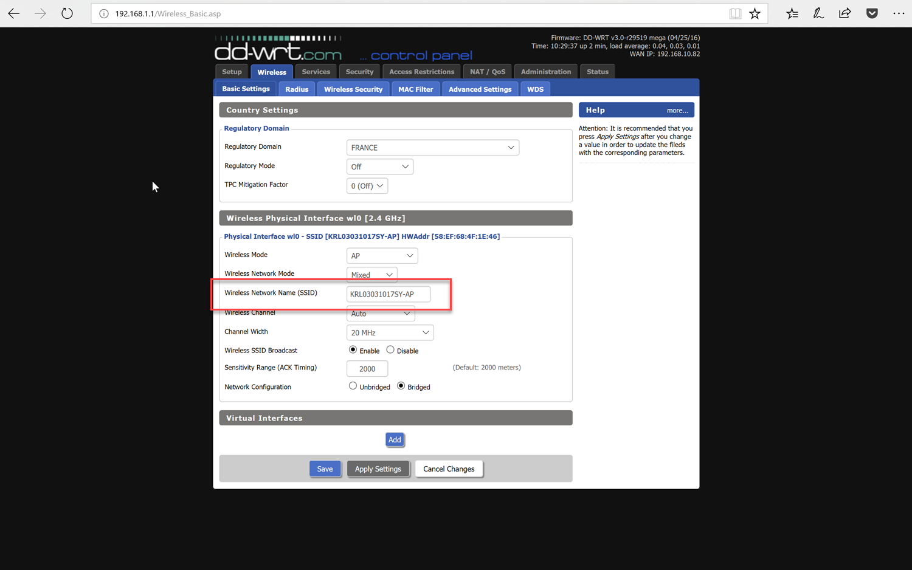

<!--
    Page : Features/Hotpot
    Author : Alexis CONIA
    Latest Update : 19/02/2018
    Confidential : No
	Partner : No
	Public : Yes
    Version : 1.1
-->

We are currently trying to qualify several routers to use in conjunction with Kickle. Our main requirement is a router that can run DDWRT. This OS enables us to always use the same admin interface. We can also manage some integrations directly in Kickle using scripts and HTTP requests.

As of today, we have tried the following routers: 

* Linksys E1200W : https://www.linksys.com/us/support-product?pid=01t80000003KRTzAAO

Please find below the procedure to configure it (we are using E1200): 

1. Connect the router and start it
2. Go to [DDWRT](https://www.dd-wrt.com) and find the specific page for your router. For example : [DDWRT for Linksys E1200](https://dd-wrt.com/wiki/index.php/Linksys_E1200v2)
3. Follow the instructions to flash the device and move it to the DDWRT OS

For E1200 :  

* Connect to http://192.168.1.1. Log in via the default admin account (admin/admin)  

* Click on **Administration** and **Firmware Upgrade**

* Update using the first firmware. Wait until the page asks you to login.
You are now on DDWRT. Login to http://192.168.1.1 (default account : root/admin)

* Click on **Administration** and **Firmware Upgrade**

* After rebooting, the router is ready to be configured. Go to Admin portal and log in.
Click on **Administration** and **Backup**

* Download the [configuration file](./resources/RouterBackup.1.0.bin) 
* Select the file on the admin portal and browse to file's location. Click on **Restore**  
The device will reboot and is then ready to go.

## Global Configuration
The router is configured with the following settings : 

* By default, the router is configured with Kickle's name on :  
    * Router Name
    * Guest Wifi SSID
* Default admin account is : 
    * Account: **Administrator** (with A in uppercase)
    * Password : **Default Kickle's password**
* Default Network Configuration :
    * WAN interface is in DHCP mode
    * Network Address is **192.168.1.1/24**
    * Only the port 1 is enabled
    * DHCP is enabled for port 1 (network 192.168.1.0/24)
    * DHCP is configured to deliver 2 addresses (192.168.10.100 and 192.168.10.101)
    * Default Admin Interface URL on http://WAN-Address:8181
    * Port Forwarding is configured for Mirror Op Ports. So the Router's WAN Address can be used to connect to Mirror Op.
* Wifi configuration :
    * Default SSID is **Kickle Name-AP**
    * Default Wifi Key is **kickleshare**
    * There is a DHCP server only for Wifi (Network 192.168.14.0/24)
* Security Aspect :
    * Policy rules are bloking traffic to WAN and Kickle's Network. 
        * An user connected to guest wifi can only access Mirror Op and HTTP to Kickle
        * An user connected to guest wifi can only access HTTP and HTTPS to WAN
    * NAT is configured. So all this configuration is hidden behind WAN IP Address
    * Port Forwarding is configured to route HTTP Connexion to Kickle

## Configuration for each Kickle

By default, the router is configured with Kickle's name on :
* Router Name
* Guest Wifi SSID

1. Connect to Admin portal
2. Go to **Setup** and **Basic Setup** to modify router's name

3. Click on **Save** and **Apply Settings**
4. Go to **Wireless** and **Basic Settings** to update SSID

5. Click on **Save** and **Apply Settings**
6. Reboot the device (**Administration** and **Management**)