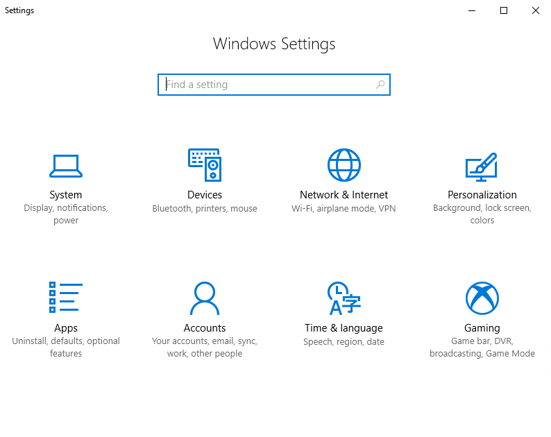
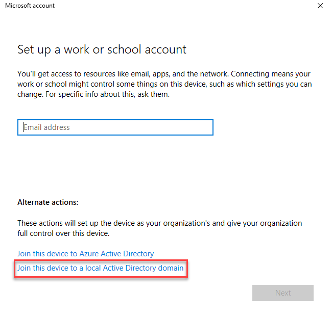
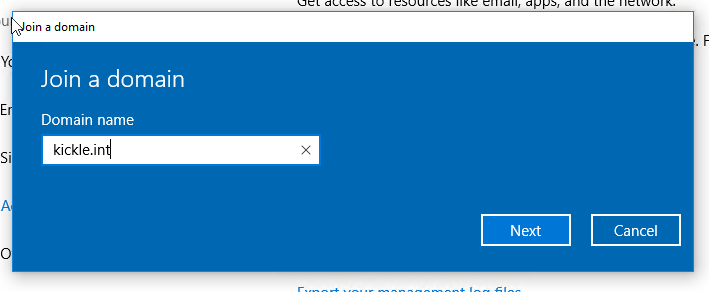
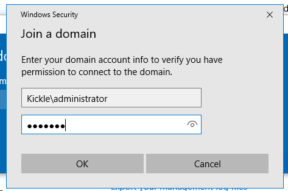
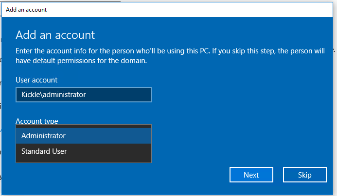
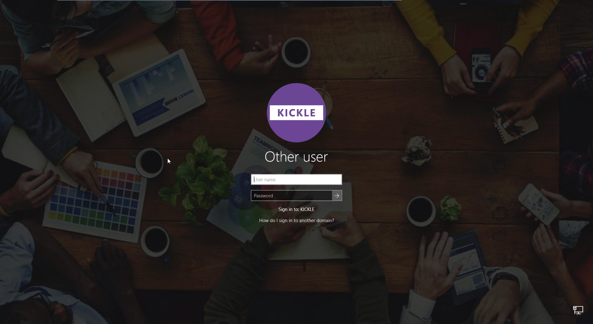
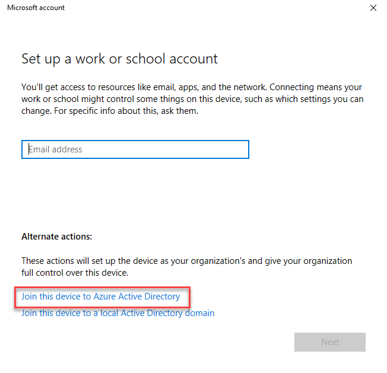
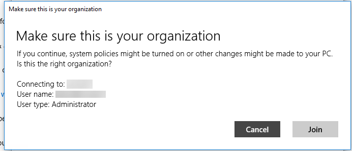
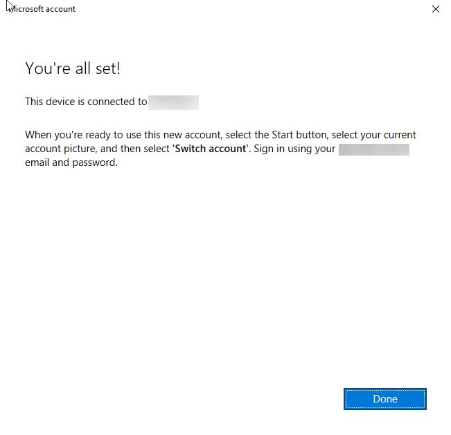

<!--
    Page : Manage/Join to AD
    Author : Alexis CONIA
    Latest Update : 23/10/2017
    Confidential : No
	Partner : No
	Public : Yes
    Version : 1.0
-->

Regarding your IT policies, you want to join Kickle to Active Directory. By Default, Kickle is in workgroup and configured with two accounts :

* **Kickle** : which is the account configured for auto login. It's a simple user
* **Administrator** : Default Local Windows 10 Administrator

You can join Kickle either to your local AD or Azure AD.
We are recommanding to set Kickle to a specifig OU and block inheritance (to avoid desactivation of local admin account for example)

## Join Kickle to your local AD

1. Start Kickle in [admin mode](admin-mode.md)
2. Start an explorer by typing **explorer** in the powershell window
3. Click on the Windows Flag and on System Gear to launch Settings Apps

3. Click on **Accounts** and on **Access work or school**

4. Click on **Connect** and **Join this device to local Active Directory**

5. Set you AD domain

6. Fill the form with your administrator credentials

7. If your account is correct, Windows asks to specify the local group. Select **Administrator**

8. Restart your computer. Kickle is rebooting and starts automatically to Kicke App
9. If you switch to admin mode, you can now log in with your domain account.

## Join Kickle to Azure AD
1. Start Kickle in [admin mode](admin-mode.md)
2. Start an explorer by typing **explorer** in the powershell window
3. Click on the Windows Flag and on System Gear to launch Settings Apps

3. Click on **Accounts** and on **Access work or school**

4. Click on **Connect** and **Join this device to Azure Active Directory**

5. Enter your Azure AD login and password

6. Confirm organization and click on join:

7. Click on **Done** to confirm

