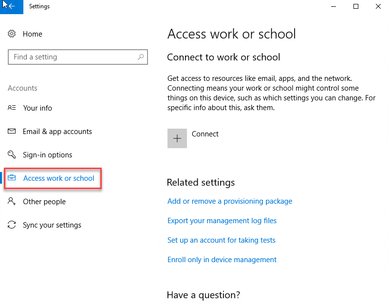
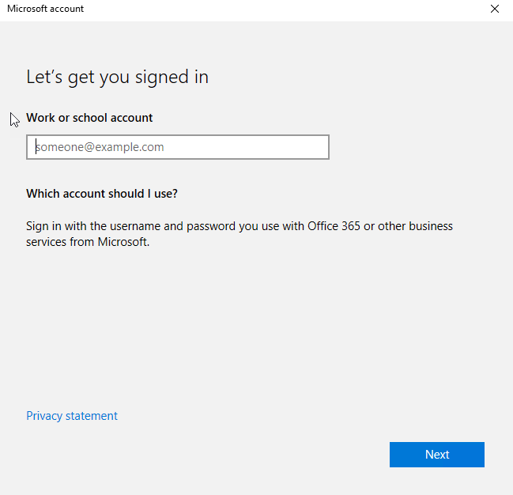

<!--
    Page : Manage/Join to AD
    Author : Alexis CONIA
    Latest Update : 23/10/2017
    Confidential : No
	Partner : No
	Public : Yes
    Version : 1.0
-->

With respect to your IT policies, you wish to join Kickle to the Active Directory. By default, Kickle can be found in Workgroup and is configured with two accounts:

* **Kickle**: which is the account configured for auto login. It's a simple user.
* **Administrator**: the default local Windows 10 Administrator.

You can join Kickle either to your local AD or Azure AD.
We recommend setting Kickle to a specific OU and blocking inheritance (to avoid deactivation of the local admin account, or configure specific settings for local users).

##Useful info for GPO
Kickle is set up with a local GPO to configure certain settings:

* Computer :
    * Set powershell script "execution mode"
    * Power settings to avoid hibernation and sleep mode
    * OneDrive and Cortana are disabled by default
    * Store is disabled
    * Windows Update : Updates are configured by local GPO
    * Explorer : Local Disk are hidden and default shares are disabled

Auto login is not configured by GPO. The keys are added directly to the registry.
The above settings are not mandatory but are recommended for a good experience using Kickle.

## Join Kickle Unit to Your Local AD

1. Start Kickle in [admin mode](admin-mode.md)
2. Start an explorer by typing **explorer** in the powershell window.
3. Click on the Windows Flag and on System Gear to launch Settings Apps

3. Click on **Accounts** and on **Access work or school**

4. Click on **Connect** and **Join this device to local Active Directory**

5. Set your AD domain

6. Fill in the form with your administrator credentials

7. If your account is correct, Windows asks to specify the local group. Select **Administrator**

8. Restart your computer. Kickle reboots and automatically launches the Kickle App.
9. If you switch to admin mode, you can now log in with your domain account.

## Join Kickle to Azure AD
1. Start Kickle in [admin mode](admin-mode.md)
2. Start an explorer by typing **explorer** in the powershell window
3. Click on the Windows Flag and on System Gear to launch Settings Apps

3. Click on **Accounts** and on **Access work or school**

4. Click on **Connect** and **Join this device to Azure Active Directory**

5. Enter your Azure AD login and password

6. Confirm organization and click on join:

7. Click on **Done** to confirm

