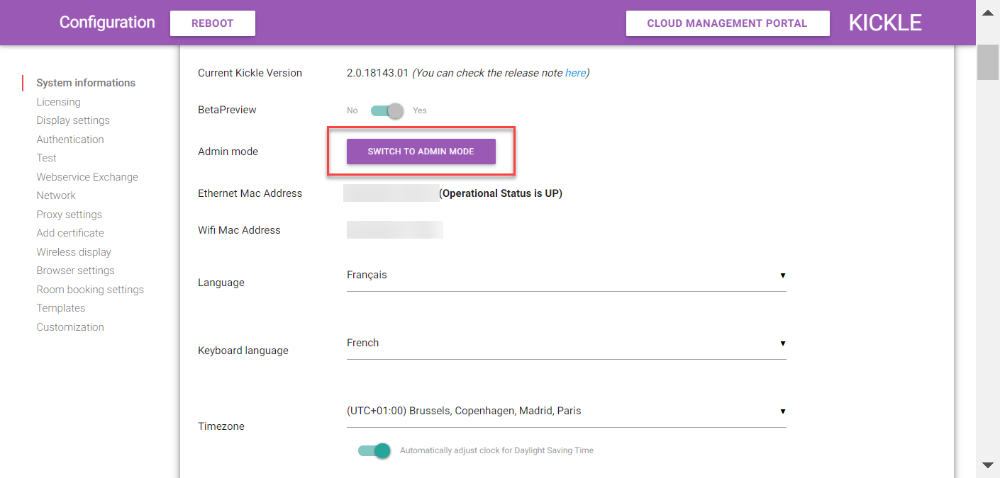

<!--
    Page : Manage/Start in admin mode
    Author : Alexis CONIA
    Latest Update : 02/11/2017
    Confidential : No
	Partner : No
	Public : Yes
    Version : 1.0
-->

Admin mode enables every admin to restart Kickle as a "normal" Windows 10 PC and access to a session.
In this mode, you can access to the explorer for example.

1. Start Admin portal by entering Kickle's IP address
2. Log in with administrator account

3. In the first panel, you have a toggle to activate Admin Mode. Move the toggle to yes

4. Click on reboot in the header
5. Kickle is restarting and asks Administrator to Login
